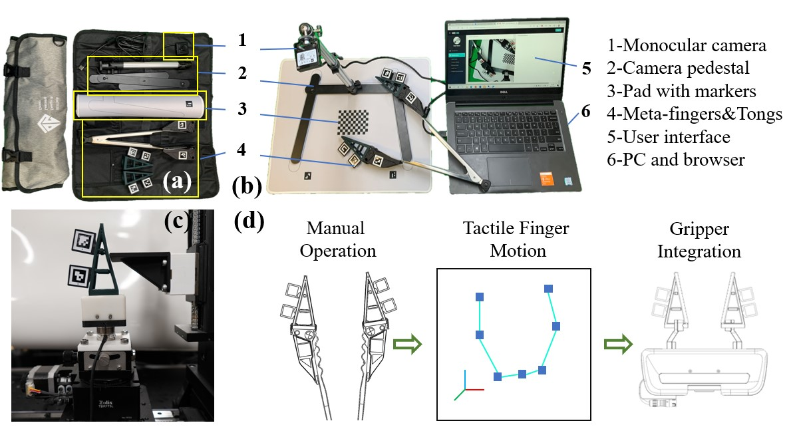
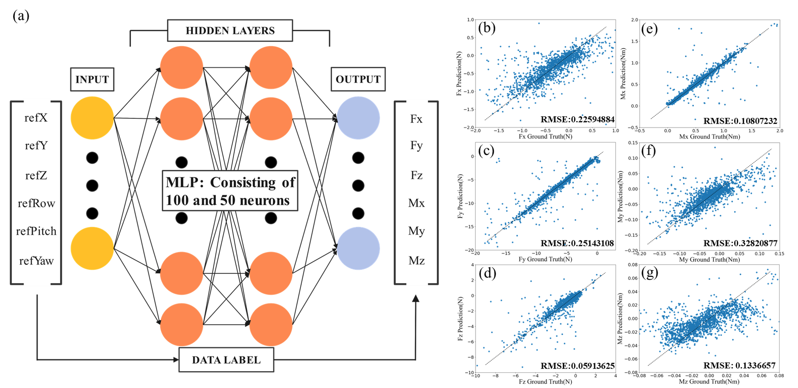
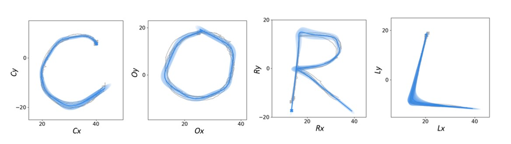

# SoftRoboticTongs
The GitHub repo for ICRA submission "Vision-based, Low-cost, Soft Robotic Tongs for Shareable and Reproducible Tactile Learning"

# HardWare Design
All hardware mentioned in this article is stored in hardWare files in a processable format for shareable and reproducible robot learning, and the cost of a set of hardware does not exceed $50. We will not disclose the manufacturing materials and process details of the soft fingers used in the article. If you need it, you can leave a message and we will send you a complete set of hardware. Its overall style is shown in the figure below, and its use process and more details can be found in articles and videos for more guidance.

# Quick use
[Web-based software](https://me336.asyst.design/CustomSetting.html)

You can use the above websites quickly, and customize the physical meaning, visualizing and collecting data in the webpage.

# Tactile Learning

We attempt to reconstruct the mechanical information of soft fingers by attaching aruco codes to their structures.

Through the experimental bench in the above picture, we connected the bottom of the soft finger with aruco to the ATI sensor and fixed it on the linear motion platform to automatically traverse and record the data of the soft finger deformation and the force information of the ATI sensor. Then it is trained through a simple MLP algorithm, and the final test result is shown in the figure.

# Demo
## Learning from demostration
You can use the data collected in the webpage to quickly perform Gaussian-based imitation learning. In order to verify the availability of the data, we used our data to reproduce on the basis of the DDD code, and the final effect is shown in the figure below. However, we just provide a convenient data collection system, you can use this data to try to complete more complex tasks.

## Teaching in robotics 

We further used this system in robotics teaching experiments and got good feedback.