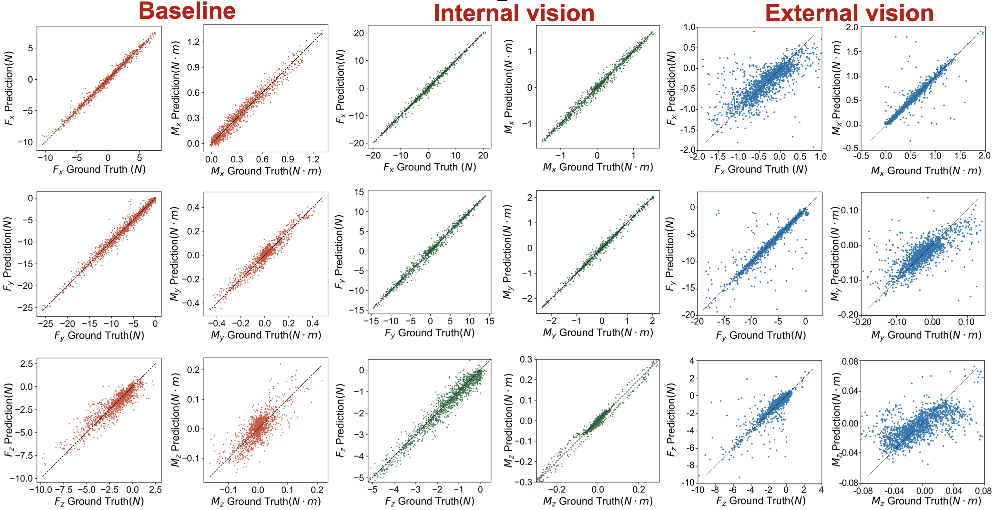

# HardWare Design
All hardware is stored in hardWare files in a processable format for shareable and reproducible robot learning, and the cost of a set of hardware does not exceed $50. We will not disclose the manufacturing materials and process details of the soft  robotic metamaterial.  If you need it, you can leave a message and we will send you a complete set of hardware. Its overall style is shown in the figure below.

# Quick use
[Web-based software](https://me336.asyst.design/CustomSetting.html)

You can use the above websites quickly, and customize the physical meaning, visualizing and collecting data in the webpage.

# Tactile Learning

## Experiment

Three data acquisition experiments are shown below.

### 1. Baseline

### 2. Internal Vision

### 3. External Vision

## Valiation set distribution

In order to facilitate the calculation of relative errors, we have excluded certain data points, as depicted by the blue shaded area in the following graph. This was necessary due to the uneven distribution and excessive clustering of values around zero.

## Neural network and result

# Demo

## Learning from demostration
You can use the data collected in the webpage to quickly perform Gaussian-based imitation learning. In order to verify the availability of the data, we used our data to reproduce on the basis of the DDD code, and the final effect is shown in the figure below. In the experiment, we collected four sets of data and wrote four letters of **ROLC (Robotics for Online Learning** 
**and Control)**, respectively. However, we just provide a convenient data collection system, you can use this data to try to complete more complex tasks.

## **Teleoperation for Human-Robot Interaction**

- ### Through internal vision 

- ### Through external vision

## Teaching in robotics 

We further used this system in robotics teaching experiments and got good feedback.

