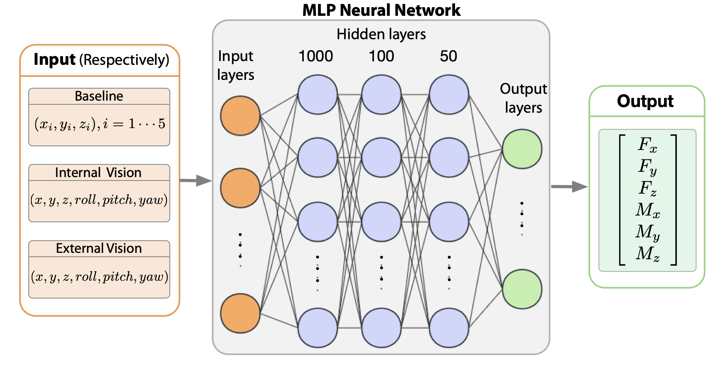

# Soft Robotic Metamaterial ML Dataset

This dataset contains data used for training and testing machine learning models for tactile sensing through soft robotic metamaterial. The dataset is organized into three categories: `baseline`, `internal vision`, and `external vision`.

## File Structure

- `baseline`: This folder contains data related to the *baseline* experiments.
- `internal vision`: Data for experiments involving *internal vision*.
- `external vision`: Data for experiments involving *external vision*.

In each folder, you will find a file named`xxx_net.py`. This is the neural network we used for each task.

## Data Format

Each CSV file in the dataset contains data for training and testing machine learning models. 

## Multilayer-Perceptron

